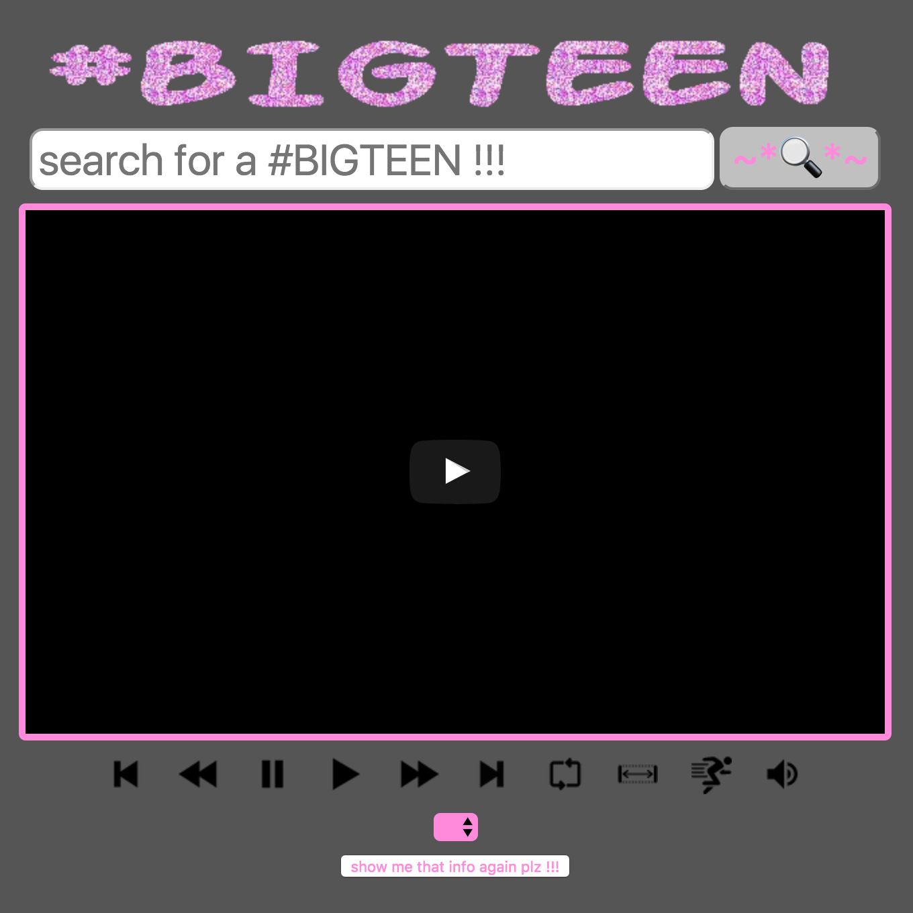

# bigTEEN.zone #notthepornthing 
#for NASDAQUIRI

web.app for midi control in live youtube performance ~

bigTEEN.zone is a Chrome web.app created for ~[big TEEN](http://www.ragethormbones.rocks/)~ with/for ~[Andrew Tham](https://www.google.com/search?q=andrew+tham&source=lnms&tbm=isch&sa=X&ved=0ahUKEwibuNHao-jTAhXC3YMKHcFXDtwQ_AUIDCgD&biw=1280&bih=633)~ that lets performers control multiple playback parameters of any video uploaded to YouTube(dot)com via MIDI protocol.

bigTEEN.zone uses both the [YouTube API](https://developers.google.com/youtube/) and the [Web MIDI API](https://www.w3.org/TR/webmidi/) 

